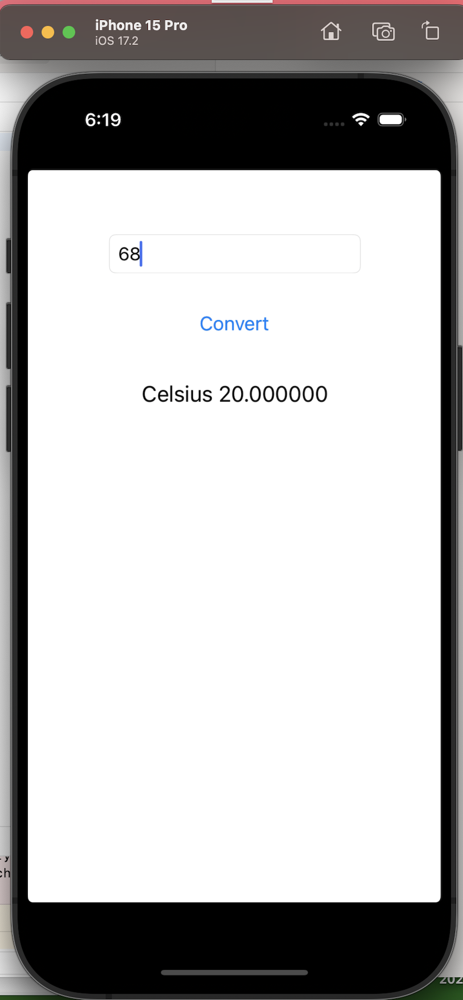

# CMPE277-iOS-UnitConverterApp
An iOS app to convert temperature from Fahrenheit to Celsius and distance from Miles to Kilometers

*	University Name: http://www.sjsu.edu/
*	Course: CMPE 277 - Smartphone App Dev
*	Professor: [ChandraSekar Vuppalapati](https://www.linkedin.com/in/chandrasekarvuppalapati/)

### Screenshots

Home Screen: Initial Unit Converter iOS App

Updated the iOS app to include distance conversions:

Entering temperature in Fahrenheit:

Entering distance in Miles to convert it into Kilometers:

